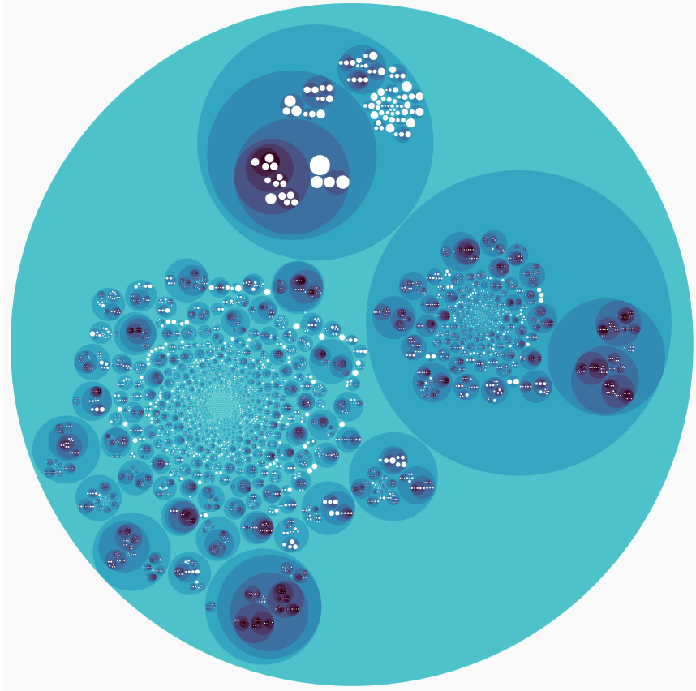

This web page present the replication package used to mine the Library patterns and a short video illustrating a user-friendly tool to visualize and navigate through the identified patterns

[Dataset](https://github.com/saiedmoh/LibCUP/blob/master/githubsnapshot.zip)

Click the image for the tool demo

<h1>Authors:</h1>

-Mohamed Aymen Saied - Concordia University / Université de Montréal (m_saied@encs.concordia.ca)

-Ali Ouni - ETS Montreal - Ecole de Technologie Superieure (ali.ouni@etsmtl.ca)

-Houari Sahraoui - Université de Montréal  (sahraouh@iro.umontreal.ca)

-Raula Gaikovina Kula - Osaka University (raula-k@ist.osaka-u.ac.jp)

-Katsuro Inoue - Osaka University (inoue@ist.osaka-u.ac.jp)

-David Lo - Singapore Management University (davidlo@smu.edu.sg)
